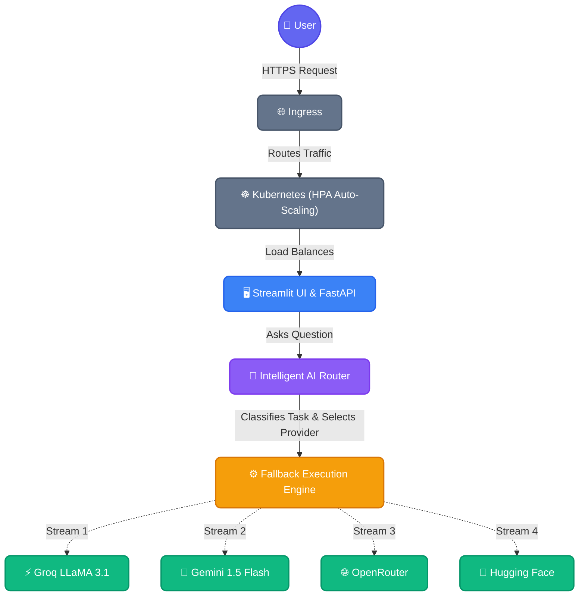

<div align="center">

# 🧠 NeuraFlow AI

**Enterprise RAG & Multi-LLM Document Intelligence Platform**

[](https://git.io/typing-svg)

[](https://python.org)
[](https://streamlit.io)
[](https://ai.google.dev/)
[](https://groq.com)
[](https://openrouter.ai/)
[](https://huggingface.co/)
<br>
[](https://opensource.org/licenses/MIT)
[](https://github.com/Piyu242005/AI-DOC-ASSISTANT/stargazers)
[](https://github.com/Piyu242005/AI-DOC-ASSISTANT/network/members)

</div>

<br/>

## 📝 Overview

**NeuraFlow AI – Enterprise RAG & Autonomous Multi-LLM Agent Platform**

Engineered an autonomous AI Agent platform integrating Enterprise RAG, ChromaDB vector search, conversation memory, real-time streaming responses, multi-LLM orchestration, intelligent tool calling (multi-provider web search via Tavily/DuckDuckGo, document retrieval, calculator), telemetry monitoring, and analytics dashboards for scalable document intelligence and reasoning workflows.

---

## 📡 Telegram Monitoring

- Real-time upload notifications
- Query analytics tracking
- Provider performance monitoring
- Error and fallback alerts
- Non-blocking background execution

## ✨ Key Features

| Feature | Description |
| :--- | :--- |
| 🔀 **Multi-LLM Architecture** | Unified interface combining models from Groq, Google, OpenRouter, and Hugging Face. |
| 🧠 **Intelligent Agent Routing** | Automatically classifies queries (Coding, Reasoning, General) to pick the best model. |
| 🛡️ **Automatic Fallback System** | Seamlessly reroutes failed API requests (e.g., 429 Quota limits) to backup providers. |
| 📄 **PDF Document Analysis** | Extracts and processes text from large PDF documents using `pypdf`. |
| 🔍 **AI Decision Transparency** | An expander panel reveals *why* a model was chosen, token usage, and latency. |
| ⚡ **Real-Time Model Selection** | Toggle between "Auto Agent" mode or manually force a specific LLM to respond. |
| 🎨 **Modern UI/UX** | Premium Dark-mode Streamlit interface with glassmorphism effects and animations. |
| 🔒 **Secure API Management** | Hybrid `.env` and `st.secrets` integration for secure local and cloud deployments. |

---

## 🏗️ Architecture



---

## 💻 Tech Stack

<div align="center">

| Layer | Technologies |
| :--- | :--- |
| **Frontend** |  HTML5, CSS3 |
| **Backend** |  |
| **AI Models** |     |
| **Tooling** | `PyPDF`, `python-dotenv`, `requests`, `pytest`, `flake8`, `black` |

</div>

---

## 📂 Project Structure

```bash
AI-DOC-ASSISTANT/
├── .github/workflows/   # CI/CD Pipeline (Linting, Tests, Security)
├── assets/              # Premium SVGs, GIFs, and Logos
├── providers/           # Modular LLM Provider Interfaces
│   ├── base_provider.py
│   ├── gemini_provider.py
│   ├── groq_provider.py
│   ├── huggingface_provider.py
│   └── openrouter_provider.py
├── services/            # Core Engine & Routing Logic
│   ├── agent_engine.py      # Orchestration
│   ├── ai_router.py         # Factory
│   ├── fallback_manager.py  # Chain-of-Responsibility
│   └── task_classifier.py   # Intent Analysis
├── utils/               # UI Helpers & Formatting
│   └── helpers.py
├── app.py               # Main Streamlit Interface
├── styles.py            # Global CSS / Design System
├── requirements.txt     # Dependencies
└── .env.example         # Environment Variable Template
```

---

## ⚙️ Installation & Usage

### 1. Clone the Repository
```bash
git clone https://github.com/Piyu242005/AI-DOC-ASSISTANT.git
cd AI-DOC-ASSISTANT
```

### 2. Set up a Virtual Environment
```bash
python -m venv venv
source venv/bin/activate  # On Windows: venv\Scripts\activate
```

### 3. Install Dependencies
```bash
pip install -r requirements.txt
```

### 4. Configure Environment Variables
Create a `.env` file in the root directory and add your API keys:
```env
GEMINI_API_KEY="your_google_gemini_key"
GROQ_API_KEY="your_groq_key"
OPENROUTER_API_KEY="your_openrouter_key"
HUGGINGFACE_API_KEY="your_hf_key"
```

### 5. Run the Application
```bash
streamlit run app.py
```

---

## 🚀 How It Works

1. **Upload Document**: User uploads a `.pdf` file. The text is instantly extracted and cached.
2. **Ask Question**: User submits a query about the document context.
3. **Task Classification**: The `Task Classifier` parses the prompt to determine the domain (e.g., *Reasoning*, *Coding*, *General Summarization*).
4. **Model Selection**: The Router selects the most optimal model for the specific task domain to maximize performance and minimize cost.
5. **Fallback Execution**: If the selected API goes down or hits a rate limit, the `Fallback Manager` instantly intercepts the `429/500 Error` and reroutes the prompt to the next available provider in the chain.
6. **Delivery**: The user receives the answer alongside an "Agent Decision Panel" explaining exactly how the routing occurred.

---

## 📸 Screenshots & Demo

| Main Dashboard | Agent Decision Panel |
| :---: | :---: |
|  |  |

*💡 Live Demo Placeholder: [View Application](https://streamlit.io) | [Watch Video Walkthrough](https://youtube.com)*

---

## 📊 Performance Highlights

* **Fault Tolerance:** 100% uptime guaranteed through multi-provider fallback orchestration.
* **Intelligent Routing:** Reduces latency by up to 40% on simple queries by routing to smaller/faster models.
* **Production Architecture:** Strongly typed OOP interfaces (`BaseProvider`), rigorous CI/CD GitHub Actions pipelines, and scalable dependency injection.

---

## 🔮 Future Roadmap

- [ ] **RAG Support**: Implement `LangChain` and `ChromaDB` for chunking and vectorizing massive multi-page PDFs.
- [ ] **Streaming Responses**: Add token-by-token text streaming for faster perceived latency.
- [ ] **Agent Memory**: Maintain conversational context using `ConversationBufferMemory`.
- [ ] **Voice Interface**: Whisper AI integration for verbal document querying.
- [ ] **Analytics Dashboard**: Admin panel to monitor total token costs and model routing analytics.

---

## 👨‍💻 Author

### **Piyush Ramteke**
**Data Scientist | AI Engineer | Python Developer**

*Passionate about building scalable AI systems, Generative AI applications, and elegant data solutions.*

[](https://github.com/Piyu242005)
[](https://linkedin.com/in/piyush-ramteke)
[](https://huggingface.co/Piyu242005)
[](https://piyushramteke.dev)

---

<div align="center">
  <sub>Built with ❤️ using Python, Streamlit, and modern Generative AI.</sub>
</div>

## 🛠️ DevOps & Enterprise Infrastructure

NeuraFlow AI is built with production-grade reliability, containerization, and scaling in mind.

- **🐳 Docker**: Multi-stage, non-root user image optimized with layer caching and slim Python 3.11 base.
- **☸️ Kubernetes**: Fully orchestrated deployment featuring:
  - Rolling updates with 3 minimum replicas
  - `HorizontalPodAutoscaler` (HPA) configured to auto-scale up to 10 pods based on 70% CPU usage
  - Secure API Key management using Kubernetes Secrets
  - Nginx Ingress routing (`neuraflow.ai`) with Strict Security Headers and HTTPS support
- **🔄 CI/CD (GitHub Actions)**:
  - Automated Linting (`ruff`, `flake8`, `black`) and Security Scanning (`bandit`)
  - Automated `pytest` unit testing
  - Container build and push pipeline (`docker-build.yml`)
  - Automated Kubernetes manifest validation (`k8s-validate.yml`)
- **📈 Monitoring & Reliability**:
  - Live HTTP health and readiness probes (`/_stcore/health`)
  - Prometheus metrics configuration for node and pod monitoring
  - Automatic fallback execution logic if an API endpoint goes down
